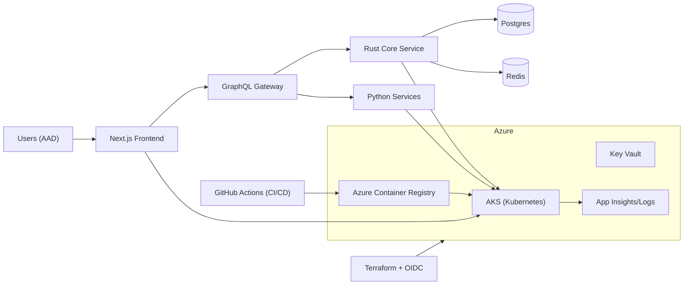

## PolicyCortex Pitch Deck

### How to use this deck
- Copy sections into your slide tool (Google Slides, PowerPoint, Pitch) as-is.
- Keep the Mermaid diagram or replace with your own architecture image.
- Replace placeholders like X/Y/A/B with pilot numbers.

## Executive summary
- **Tagline**: AI-driven cloud governance for Azure that turns policy sprawl into real-time, cross-domain decisions.
- **Problem**: Cloud security, compliance, and cost signals live in silos; teams drown in alerts and manual work.
- **Solution**: PolicyCortex correlates identity, network, policy, runtime, and spend to drive automated, auditable actions.
- **Why now**: Azure adoption + AI-native ops; regulators and boards demand provable controls; teams must do more with less.
- **Business value**: Fewer incidents, faster audits, lower spend, higher engineering velocity.

## Core proposition: unified multi‑cloud governance (single app, single dashboard)
- **One console, all clouds**: Aggregate and govern resources, policies, identities, and spend across clouds from a single UI and API.
- **Federated data model**: Multi‑cloud provider abstraction feeds a consistent GraphQL and REST surface so teams don’t swivel-chair across siloed tools.
- **Action hub**: Remediate via PRs/Terraform or direct API calls with tenant isolation and role/scope checks.
- **Proof points (code references)**: See “Repository references” at the end for exact file paths and line anchors your writer can cite.

## The problem
- **Fragmentation**: Security, FinOps, and platform teams use different tools that don’t agree.
- **Noise**: High alert-to-action ratio; false positives burn cycles.
- **Manual controls**: Evidence collection and policy remediation are brittle and slow.
- **Risk exposure**: Unenforced least-privilege, drift from IaC, and missing runtime visibility.
- **Audit fatigue**: Controls exist but aren’t testable or provable at audit time.

## The solution (what PolicyCortex does)
- **Cross-domain correlation (patent-backed)**: Links identity, configs, runtime, and spend to surface true risk and impact.
- **Actionable AI**: Summarizes risk, explains cause, and recommends next action; can open PRs or run Terraform changes.
- **Continuous compliance**: Maps evidence to frameworks (SOC2, HIPAA, ISO 27001, CIS, NIST) and tracks control health.
- **Guardrails over gates**: Safe, reversible changes via PRs and Terraform state; policy as code.
- **Enterprise-grade security**: Azure AD login, httpOnly sessions, zero-trust defaults.

## Product overview
- **User personas**
  - CISO / VP Security: risk posture, board reporting, audit readiness
  - Cloud Security Architect: policies, detections, auto-remediation
  - Platform / SRE: drift control, golden paths, change velocity
  - FinOps Lead: cost anomalies, unit economics, chargeback
- **Core capabilities**
  - Asset inventory (Azure resources, identities, policies)
  - Risk analytics (misconfigs, over-permissioned identities, exposed surfaces)
  - Cost governance (budgets, anomalies, waste)
  - Policy as Code & remediation (PRs, Terraform, AKS rollouts)
  - Audit trails & evidence packages
  - GraphQL API and UI for workflows

### High-level architecture


## What’s already real (repo evidence)
- **Auth enforced before UI**: Route gating via middleware; only login and auth endpoints are public (`frontend/middleware.ts`).
- **Azure AD + MSAL**: Login flow and token acquisition with secure, httpOnly `auth-token` cookie (`frontend/contexts/AuthContext.tsx`, `frontend/app/api/auth/set-cookie/route.ts`).
- **CI/CD**: Security scans, supply chain checks, infrastructure (Terraform OIDC), builds, tests, AKS deploys (`.github/workflows/entry.yml`, `application.yml`, `deploy-aks.yml`, `azure-infra.yml`).
- **Azure-native**: ACR/AKS images, runtime manifests under `k8s/dev` and `k8s/prod`.

## Differentiation (why we win)
- **Cross-domain correlation**: Not another scanner—connects identity, config, runtime, and spend to calculate real risk and business impact.
- **Explainable AI**: Human-readable rationales and remediation steps; integrates with PR workflows for trust and auditability.
- **Azure-first depth + multi‑cloud reach**: Native MSAL, ACR/AKS, Terraform OIDC, Azure Policy mapping, with provider layer for AWS/GCP expansion via the multi‑cloud subsystem.
- **Shift-left + guardrails**: PR-based changes, infra state awareness, and rollbacks.
- **Compliance-as-evidence**: Exportable evidence packs mapped to controls, not just dashboards.
- **Performance & safety**: Rust core for critical logic; zero-trust session model.

## Market and ICP
- **ICP**: Mid-market to large Azure-centric orgs (regulated: healthcare, fintech, public sector; complex: multi-subscription/multi-tenant).
- **Use cases that land**
  - Over-permissioned service principals and dangling access
  - Policy drift and audit-readiness for SOC2/ISO/NIST
  - Cost anomalies (unused IPs, idle clusters, zombie storage)
  - AKS misconfigurations (network policies, secrets, RBAC)

## Value and ROI
- **Risk**: Reduce high-severity misconfigs and over-permission by X–Y% in N weeks.
- **Cost**: Cut cloud waste by A–B% via continuous anomaly detection and guardrails.
- **Velocity**: Faster change lead time by enabling safe, PR-based remediations.
- **Audit**: Weeks → days to assemble evidence per control set.

> Replace X/Y/A/B with your pilot results.

## Business model
- **Pricing options** (choose one to test):
  - Per-subscription + per-node (AKS) tiering
  - Per-asset (resource) with volume breaks
  - Platform seat + usage add-ons (AI analyses, evidence packs)
- **Editions**: Starter (read-only), Pro (remediation), Enterprise (SAML/SCIM, custom controls, private SaaS/self-hosted)

## Go-to-market
- **Land**: Risk posture + 3–5 high-value remediations in first month.
- **Expand**: Compliance automation + FinOps, then platform engineering.
- **Channels**: Azure Marketplace private offers; MSSP and GSI partnerships.
- **Proof**: 2–4 week pilot, deploy in customer Azure, measurable outcomes.

## Security, privacy, compliance
- **AuthN**: Azure AD + httpOnly sessions; route gating.
- **Secrets**: Key Vault and GitHub OIDC (no long-lived secrets).
- **Isolation**: Customer data stays in their Azure; images in ACR; workloads in AKS.
- **Compliance**: Map detections to SOC2/ISO 27001/CIS; export evidence packs.

## Repository references (for writers without repo access)
Use the exact paths/anchors below when citing implementation evidence in the deck or narrative.

### Authentication and route gating (UI blocked until sign‑in)
```69:86:frontend/middleware.ts
  // Only trust server-issued auth token presence (httpOnly). Do NOT trust client-set flags.
  const authToken = request.cookies.get('auth-token')
  const isAuthenticated = !!authToken

  // Only allow root (login) and auth endpoints without authentication
  if (pathname === '/' || pathname === '/login' || pathname.startsWith('/api/auth')) {
    // If already authenticated and trying to access login pages, redirect to tactical
```

### Session cookie endpoint (sets secure httpOnly session)
```1:18:frontend/app/api/auth/set-cookie/route.ts
import { NextRequest, NextResponse } from 'next/server'

export async function POST(req: NextRequest) {
  const { token } = await req.json()
  const res = NextResponse.json({ ok: true })
  res.cookies.set({
    name: 'auth-token',
    value: token,
    httpOnly: true,
```

### Multi‑cloud provider APIs (single dashboard across clouds)
```1769:1799:backend/services/api_gateway/main.py
@app.get("/api/v1/multi-cloud/resources")
async def get_multi_cloud_resources(
    provider: Optional[str] = None,
    resource_type: Optional[str] = None,
    request: Request = None,
    auth: Any = Depends(get_auth_context) if AUTH_ENHANCED else Depends(auth_dependency)
):
    """Get resources from multiple cloud providers"""
    resources = await multi_cloud_provider.get_resources(cloud_provider, resource_type)
    return {
        "resources": resources,
        "total": len(resources),
```

```1827:1867:backend/services/api_gateway/main.py
@app.get("/api/v1/multi-cloud/compliance")
async def get_multi_cloud_compliance(
    provider: Optional[str] = None,
    request: Request = None,
    auth: Any = Depends(get_auth_context) if AUTH_ENHANCED else Depends(auth_dependency)
):
    """Get compliance status from multiple cloud providers"""
    compliance = await multi_cloud_provider.get_compliance_status(cloud_provider)
    return compliance
```

```1869:1904:backend/services/api_gateway/main.py
@app.get("/api/v1/multi-cloud/security")
async def get_multi_cloud_security(
    provider: Optional[str] = None,
    request: Request = None,
    auth: Any = Depends(get_auth_context) if AUTH_ENHANCED else Depends(auth_dependency)
):
    """Get security findings from multiple cloud providers"""
    findings = await multi_cloud_provider.get_security_findings(cloud_provider)
    return {
        "findings": findings,
        "total": len(findings),
```

### GraphQL gateway (federated API surface)
```160:185:graphql/gateway.js
async function startGateway() {
  const server = new ApolloServer({
    typeDefs,
    resolvers,
    csrfPrevention: isProd,
    introspection: !isProd,
  })
  const { url } = await startStandaloneServer(server, { listen: { port: 4000 } })
  console.log(`🚀 PolicyCortex GraphQL Gateway ready at ${url}`)
}
```

### Terraform/OIDC infra pipeline (Azure‑native, keyless)
```149:161:.github/workflows/azure-infra.yml
      - name: Terraform Init (AzureRM backend)
        run: |
          terraform init -input=false \
            -backend-config="resource_group_name=${{ steps.names.outputs.TFSTATE_RG }}" \
            -backend-config="storage_account_name=${{ steps.names.outputs.TFSTATE_SA }}" \
            -backend-config="container_name=${{ steps.names.outputs.TFSTATE_CONTAINER }}" \
            -backend-config="key=${{ steps.names.outputs.TFSTATE_KEY }}" \
            -backend-config="access_key=${{ steps.storage_key.outputs.STORAGE_KEY }}"
```


## Roadmap (next 2–3 quarters)
- Deeper Azure Policy graph and drift prevention
- IAM least-privilege recommender (graph-based access reduction)
- FinOps unit economics & anomaly root-cause (service-to-service)
- Control libraries and audit pack generator
- Golden path wizards (RBAC, network, secrets, AKS baselines)
- Partner integrations (Defender for Cloud, Sentinel, Wiz/Prisma, GitHub Advanced Security)

## Competitive landscape
- Microsoft Defender for Cloud, Azure Policy, Wiz, Prisma Cloud, Lacework, Orca
- **Our edge**: Cross-domain correlation + explainable remediation + PR-first change model in an Azure-native stack

## Demo storyline (10 min)
1. Login with Microsoft (MSAL); show blocked UI without auth.
2. Posture dashboard: top risky identities, misconfigs, and costs.
3. Drill: one critical identity/path; explain blast radius and evidence.
4. One-click fix: open PR and Terraform plan; safe rollout to AKS.
5. Evidence pack: export control mapping; share a link.
6. FinOps anomaly: identify cluster waste and demonstrate auto-scheduling policy.

## Slide-by-slide outline
- Problem • Why now
- Solution • Product overview
- Architecture (diagram) • Security model
- Differentiators • Competitive positioning
- ICP & Use cases • Value/ROI
- GTM & Pricing
- Traction (or early pilots) & Case studies
- Roadmap & Vision
- Team & IP (patent coverage)
- Ask & Use of funds

## KPIs to track
- Mean-time-to-remediate policy gaps
- % of auto/remediated changes via PRs
- Alert-to-action ratio
- Compliance control pass rate
- Waste hours/$ saved
- Enterprise expansion (subs, workloads)

## Risks and mitigations
- Buyer fatigue from “another dashboard” → Anchor on PR-based outcomes
- Over-automation risk → Guardrails, simulations, approvals
- Azure tie-in → Expand to multi-cloud with adapters (later)
- Data sensitivity → Keep data in customer tenant, evidentiary minimalism

## Appendix A: Tech deep-dive (stack)
- Frontend: Next.js, MSAL, GraphQL client
- Gateway: Node/GraphQL
- Core: Rust (policy/graph logic)
- Services: Python (analytics, jobs)
- Data: Postgres, Redis
- Infra: AKS, ACR, Key Vault, App Insights, Terraform (OIDC)
- CI/CD: GitHub Actions with security, supply chain, deploy gates

## Appendix B: CI/CD evidence (what runs)
- Runner setup, Docker health checks
- Secret scanning (Gitleaks), license and dependency review
- Supply chain (Trivy), security summary
- Infra: Terraform plan/apply with OIDC
- Build and push images to ACR (core, frontend, graphql)
- Integration tests, then AKS deploy (dev/prod)
- Tag-based production release

## Appendix C: One-liners for sales
- **From chaos to control**: We correlate across identity, config, runtime, and spend so you can act.
- **Confidence to automate**: Explainable recommendations, PR-based changes, full audit trails.
- **Azure-native**: We meet you where you are: MSAL, AKS, ACR, Terraform OIDC.


