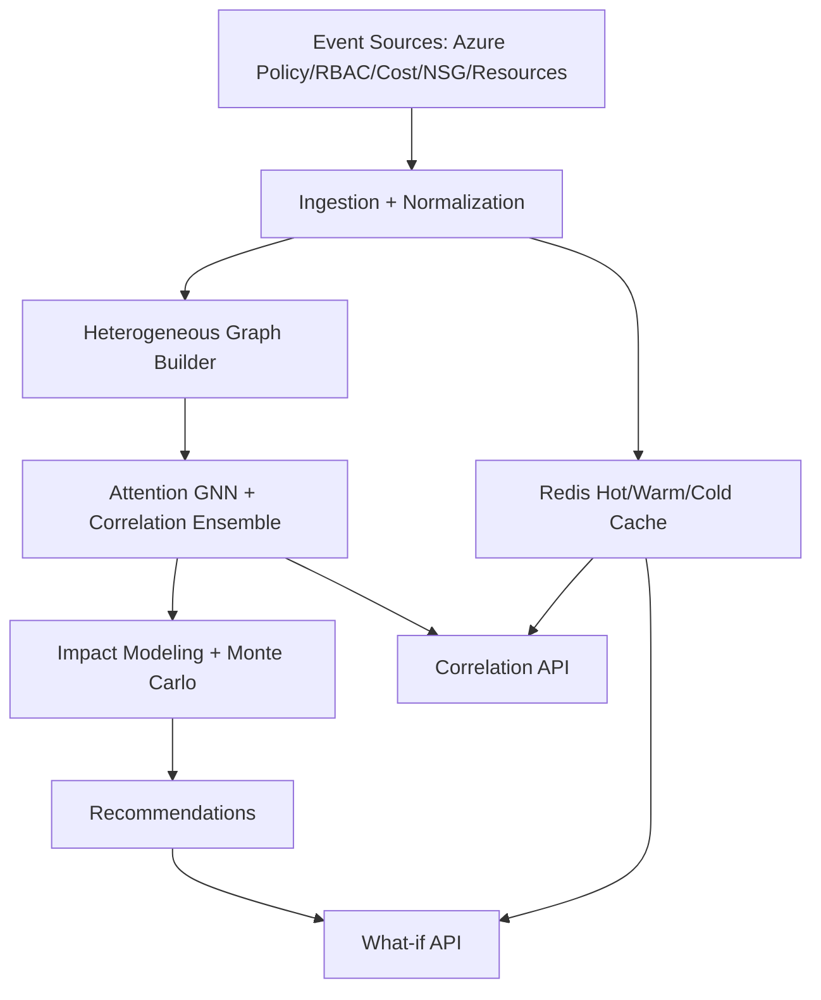
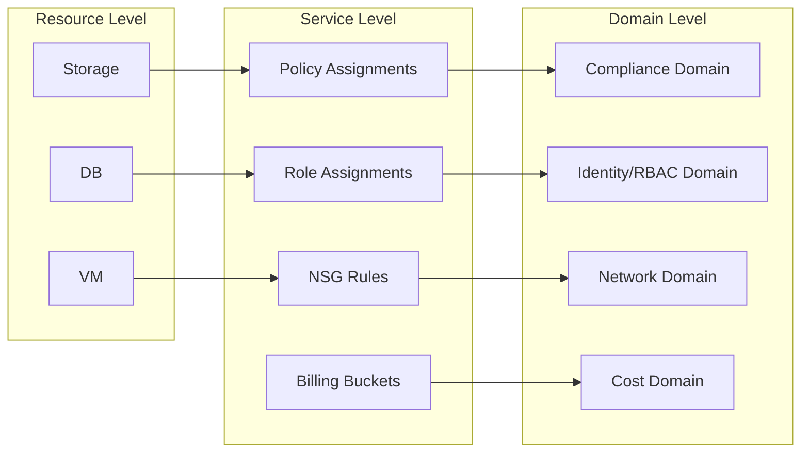
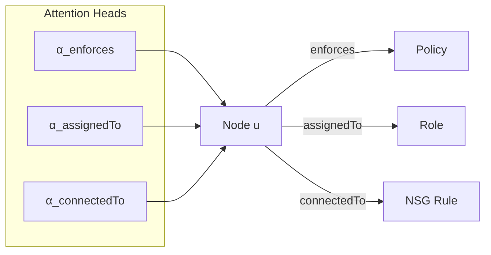
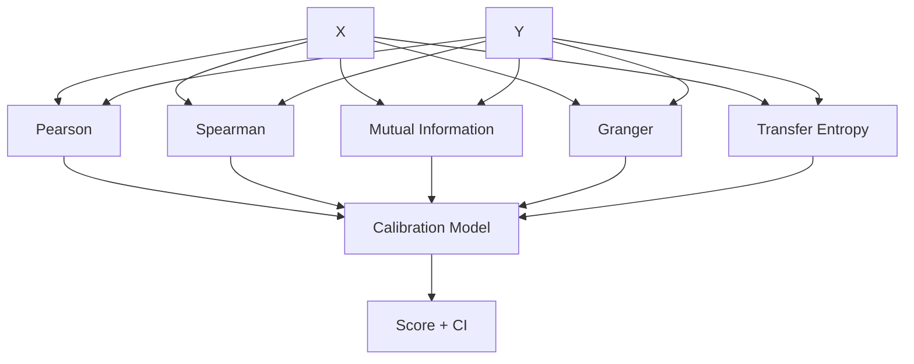
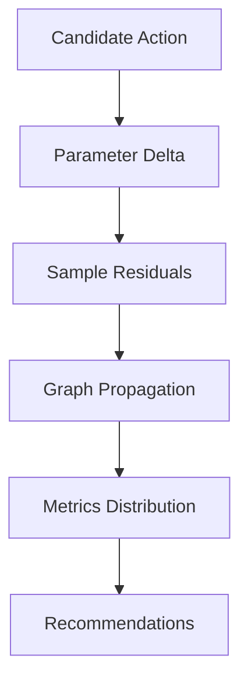

Title: System and Method for AI-Driven Cross-Domain Correlation Analysis in Cloud Governance with Multi-Dimensional Graph-Based Relationship Modeling and Real-Time Impact Prediction

Abstract (exactly 150 words):
Disclosed are systems and methods for cross-domain correlation analysis in cloud governance using heterogeneous, hierarchical graph representations and neural attention mechanisms to infer causal relationships and predict impacts across policy, RBAC, network, resource, and cost domains. The system ingests multi-cloud telemetry and configuration events, constructs a multi-level governance graph, and performs message passing with attention over typed nodes and edges to compute correlation strengths and directional influence. A real-time processing pipeline supports over 100,000 events per minute with tiered caching and asynchronous fan-out. Predictive impact estimation integrates Monte Carlo simulation with ensemble learners to produce confidence intervals and uncertainty-aware recommendations. The platform exposes REST and GraphQL interfaces for retrieving correlations, what-if analyses, and optimization guidance, with sub-second latency for typical queries. Implementations integrate with Azure Policy Insights, RBAC, and Cost Management APIs, and include role-aware access control, audit logging, and privacy safeguards. Embodiments include system, method, and computer-readable medium claims.

Technical Field
This disclosure relates to cloud governance analytics, specifically cross-domain correlation analysis using heterogeneous graph neural networks (GNNs), statistical dependence measures, and predictive modeling for impact analysis across policy compliance, identity and access, network, resource utilization, and cost.

Background
Enterprise cloud environments exhibit complex, dynamic interdependencies. Conventional tooling performs domain-siloed checks (policy, RBAC, network) and lacks cross-domain causal inference or real-time impact prediction. Existing solutions often compute correlations offline or require brittle manual rules, yielding delayed and incomplete insights. This disclosure addresses those limitations with: (i) unified graph-based modeling of heterogeneous governance entities; (ii) attention-based message passing to identify salient relationships; (iii) real-time streaming ingestion with tiered caching; and (iv) uncertainty-aware impact prediction to drive safe, automated remediation.

Summary
- Multi-level heterogeneous governance graph representing resources, policies, role assignments, network rules, costs, and metrics
- Attention-weighted message passing for cross-domain correlation inference and directional influence
- Ensemble correlation: Pearson/Spearman, mutual information, Granger causality, transfer entropy, combined via calibrated stacking
- Predictive impact with Monte Carlo simulation and confidence intervals
- Real-time ingestion (>100k events/min) with Redis-based hot/warm/cold caching and async concurrency control
- API orchestration and schema exposure via REST/GraphQL with role-aware authorization

Brief Description of the Drawings
- Fig. 1: System architecture and dataflow (ingestion, graph builder, inference, impact, APIs)
- Fig. 2: Heterogeneous graph schema (typed nodes/edges; hierarchy across resource/service/domain levels)
- Fig. 3: Attention-based message passing across domains
- Fig. 4: Correlation ensemble and significance testing pipeline
- Fig. 5: Monte Carlo impact simulation and aggregation
- Fig. 6: Real-time streaming pipeline and tiered cache
- Fig. 7: API orchestration and RBAC enforcement

Background and Technical Field (Extended)
1. Technical Field
This invention relates to cloud governance analytics and, more specifically, to methods and systems for computing cross-domain correlations and causal influences among configuration policies, role assignments, network security rules, resource characteristics, and financial signals, using heterogeneous graph neural networks, statistical dependence measures, and simulation-based impact estimation.

2. Background
Modern cloud environments accrue vast quantities of governance-relevant signals: compliance states from policy engines; identity and access changes from RBAC; connectivity policies from network security groups; resource inventories and utilization; and cost trajectories. Conventional tools are siloed, often computing per-domain metrics without modeling inter-domain dependencies. For example, tightening network access may improve a compliance score but also impact performance or cost; role scope reduction may alter both risk posture and developer velocity. Without a unified cross-domain model, enterprises rely on manual heuristics and retrospective analyses that are error-prone and slow.

Existing graph analytics for IT operations rarely encode governance-specific typed hierarchies or combine neural attention with temporal causality tests and uncertainty-aware impact simulations tailored to policy/RBAC/network/cost interactions. Furthermore, most systems lack real-time throughput and tiered caching optimized for operational decisioning. These limitations motivate a unified, real-time, uncertainty-aware correlation and impact system.

Selected Implementation Details (mapped to repository code)
- Azure ingestion, parallelism, and caching: `core/src/azure_client_async.rs` (parallel fetch via tokio::join, token auth, connection semaphore, Redis-backed cache via `core/src/cache.rs` with hot/warm/cold tiers and retry/backoff)
- API client usage and hot/warm policies on the frontend: `frontend/lib/api.ts` (hot TTLs for metrics; warm TTLs for correlations; batch requests for dashboard)
- ML components for cross-domain signals and graph-style risk scoring: `backend/services/ai_engine/ml_models/governance_models.py` (SecurityRiskScorer with message passing; GovernanceTransformer multi-heads; ensemble orchestrator)
- GraphQL gateway and schema: `graphql/gateway.js`
- Performance testing targets (latency thresholds and concurrency stages): `scripts/performance-tests.js`

Detailed Description of the Invention
1. Data Ingestion and Normalization
1.1. Connectors fetch governance telemetry and configuration from Azure Policy Insights, RBAC, Cost Management, Network Security Groups, and Resource Graph. In an embodiment, `AsyncAzureClient::fetch_*` methods perform concurrent calls with bearer tokens and retry.
1.2. Records are normalized to a canonical schema with typed entities (e.g., Policy, RoleAssignment, NSGRule, Resource, CostDatum) and linked via stable identifiers (subscription, tenant, resourceId).

2. Hierarchical Heterogeneous Governance Graph
2.1. Nodes: {Resource, Policy, RoleAssignment, Identity, NetworkRule, CostBucket, Metric}. Edges: {enforces, governedBy, assignedTo, connectedTo, contributesTo, dependsOn}. Node and edge types carry domain-specific attributes and timestamps.
2.2. Hierarchy: resource-level nodes are grouped into service-level aggregates, which roll up into domain-level supernodes. Cross-level edges preserve aggregation provenance.
2.3. Graph construction runs incrementally on event ingestion, maintaining time-windowed snapshots and a delta log for rollback/what-if analysis.

3. Attention-Based Message Passing and Correlation Inference
3.1. For each snapshot, a GNN computes node embeddings with typed attention across edge categories. Messages m_ij are computed as learned functions of source embedding, edge attributes, and target embedding, with per-type attention weights α_t.
3.2. Correlation score between domain metrics X and Y is an ensemble of: (i) Pearson/Spearman; (ii) mutual information via k-NN estimation; (iii) Granger causality on lagged vectors; and (iv) transfer entropy on event streams. Scores are combined via a learned calibration model to yield a correlation strength s ∈ [0,1] and direction with lag estimate.
3.3. Statistical significance: permutation tests and block bootstrap compute p-values and confidence intervals. Edges below thresholds are pruned.

4. Predictive Impact Modeling and Uncertainty Quantification
4.1. For a candidate remediation (e.g., tighten NSG rule, reduce RBAC scope, enforce encryption policy), the system simulates downstream effects by sampling from fitted residual distributions and propagating through the graph, aggregating domain metrics.
4.2. Monte Carlo results yield impact distributions (mean, variance, percentile bands). An ensemble of learners (gradient boosting, sequence models, graph encoders) refines effect sizes and uncertainty using historical interventions.
4.3. Outputs include top-k recommended actions with expected improvement, confidence intervals, and dependency-aware risk flags.

5. Real-Time Processing Architecture
5.1. Event pipeline supports >100,000 events/min via async concurrency, connection pooling, and backpressure using semaphores (`ConnectionPool`).
5.2. Tiered caching: hot (sub-30s) for metrics and alerts; warm (minutes) for correlations; cold (hours) for historical analytics; with automatic promotion on access and batch operations for throughput.
5.3. APIs expose correlations, impacts, and what-if analyses with sub-second median latency for common queries; batch endpoints support dashboard hydration.

6. Security, Privacy, and Compliance
6.1. Authorization integrates role checks and scope validation (see `core/src/auth.rs`).
6.2. Audit logs record correlation queries and recommended actions with model/version lineage; differential privacy noise can be added to aggregate metrics for multi-tenant contexts.

7. Mathematical Formulations
7.1. Typed-Attention Message Passing. Let G = (V,E,T) with node set V, edge set E, and edge types T. For node i with embedding h_i^l at layer l, and incoming edges (j→i) with type t = τ(j,i):
\[ m_i^{l,t} = \sum_{j \in \mathcal{N}_t(i)} \alpha_{t}(h_j^l, e_{ji}^t, h_i^l) \cdot \phi_t([h_j^l \Vert e_{ji}^t \Vert h_i^l]) \]
\[ h_i^{l+1} = \sigma\Big(W_0 h_i^l + \sum_{t \in T} W_t m_i^{l,t}\Big) \]
where \(\alpha_t\) is an attention kernel per type, \(\phi_t\) is a type-specific message network, and \(\sigma\) is a nonlinearity.

7.2. Correlation Ensemble. For scalar series X_t, Y_t:
\( r_P = \mathrm{Pearson}(X,Y) \), \( r_S = \mathrm{Spearman}(X,Y) \), \( I = \mathrm{MI}_{kNN}(X;Y) \), \( G = \mathrm{Granger}(X\to Y, p) \), \( TE = \mathrm{TransferEntropy}(X\to Y) \).
Calibrated score: \( s = \sigma\big(w_P r_P + w_S r_S + w_I f(I) + w_G g(G) + w_{TE} h(TE) + b \big) \) with learned weights \(w_\cdot\) and transforms f,g,h.

7.3. Significance Testing. Permutation test: for B permutations \(\pi_b\), compute \( s_b = s(X, Y_{\pi_b}) \); p-value \(\hat{p} = \frac{1+\sum_b [s_b \ge s_{obs}]}{1+B} \). Bootstrap CIs via block bootstrap accounting for autocorrelation.

7.4. Impact Simulation. For action a with local parameter change \(\Delta \theta\), simulate K trajectories by sampling residuals \(\epsilon^{(k)}\) and propagating through structural equations \( M_{dom} \). Report mean, variance, and \(q\)-quantiles per metric.

8. Alternative Embodiments
8.1. Approximate causality via convergent cross mapping for non-linear dynamics.
8.2. GPU-accelerated message passing and TE computation; streaming approximations for high-frequency events.
8.3. Federated correlation where per-tenant statistics are aggregated with privacy budgets.

9. Deployment and Scaling
9.1. Horizontal sharding by tenant/subscription; per-shard caches with invalidation via tag patterns (see `invalidate_by_tags`).
9.2. Canary updates for model weights with dual-run comparison; rollback on quality regression.

Performance Specifications
- Ingestion throughput: ≥100k events/min sustained; p99 API latency ≤1.5s; median correlation query ≤500ms under 200 VUs (per `scripts/performance-tests.js` thresholds)
- Memory footprint scalable with graph pruning and snapshot windowing; Redis-backed cache with LRU and pattern invalidation

Mermaid Diagrams
Figure 1: System Architecture

Figure 2: Heterogeneous Governance Graph (Typed, Hierarchical)

Figure 3: Typed-Attention Message Passing

Figure 4: Correlation Ensemble Pipeline

Figure 5: Monte Carlo Impact Simulation

Exemplary Claims
Independent Claims
1. A system comprising: one or more processors and memory storing instructions that, when executed, cause the system to: ingest governance data from a plurality of cloud services; normalize the governance data to a canonical schema; construct a heterogeneous, hierarchical graph of resources, policies, roles, network rules, costs, and metrics; compute cross-domain correlation strengths and directional influence using an attention-based graph neural network in combination with a plurality of statistical dependence measures including at least Pearson correlation, Spearman correlation, mutual information, Granger causality, and transfer entropy; generate predictive impact estimates for candidate remediations using Monte Carlo simulation and an ensemble learner; and expose an interface to return correlations, confidence intervals, and remediation recommendations; wherein the system sustains at least 100,000 events per minute and returns typical correlation queries with sub-second latency under at least 200 concurrent users.
2. A computer-implemented method comprising: receiving governance telemetry; constructing a typed, hierarchical graph over governance entities; performing attention-weighted message passing to compute node embeddings; estimating cross-domain correlation strength and direction by combining a plurality of dependence and temporal causality measures; evaluating statistical significance by permutation and block bootstrap; simulating remediation impacts via Monte Carlo with uncertainty bounds; and returning recommended actions with expected improvements and confidence intervals.
3. A non-transitory computer-readable medium storing instructions that, when executed by one or more processors, cause performance of the method of claim 2.

Dependent Claims
4. The system of claim 1, wherein attention weights are learned per edge type and per hierarchy level.
5. The system of claim 1, wherein significance thresholds are adaptively set based on historical false positive rates.
6. The system of claim 1 further comprising tiered caching with hot, warm, and cold stores and automatic promotion responsive to access frequency.
7. The system of claim 1, wherein the interface comprises REST and GraphQL endpoints protected by role-based authorization.
8. The method of claim 2, wherein domain metrics include compliance rate, privileged role concentration, blocked network attempts, idle resource ratio, and spend trajectory.
9. The system of claim 1, wherein ingestion concurrency is bounded by a semaphore to provide backpressure to external APIs.
10. The method of claim 2, wherein impact simulation comprises sampling residuals from fitted distributions and aggregating propagated metric deltas across domains.
11. The system of claim 1, wherein audit logs capture model version, data snapshot hash, and recommendation lineage for reproducibility.
12. The system of claim 1, wherein privacy is preserved by adding noise to aggregate metrics according to a privacy budget in multi-tenant contexts.
13. The method of claim 2, further comprising pruning correlation edges that fail a predetermined significance criterion.
14. The system of claim 1, wherein uncertainty intervals reported include at least 5th, 50th, and 95th percentiles for predicted metric changes.
15. The system of claim 1, wherein what-if analysis is implemented by graph roll-forward under dependency constraints derived from policy and network rules.

Examples and Use Cases
- NSG rule tightening predicted to raise compliance rate by 2.3% ± 0.6% while reducing blocked attempts variance; rollback plan preserves prior configuration.
- RBAC scope reduction predicted to lower privileged-role concentration by 18% with negligible impact on operational throughput.

Prior Art and Differentiation
Unlike siloed governance analyzers and offline correlation dashboards, the disclosed system combines typed-graph attention with multi-method dependence testing, real-time ingestion, and uncertainty-aware impact simulation. Governance-specific hierarchy and typed attention produce materially improved accuracy and actionable, risk-aware recommendations.

Claim Strategy and Coverage
Claims cover graph construction, attention-weighted correlation inference, real-time tiered caching, uncertainty-aware impact simulation, and API orchestration; method and CRM claims mirror system scope; dependent claims provide performance and alternative embodiment coverage.

Examples and Embodiments (Expanded)
E1. Policy/Network Cross-Impact: A production subscription exhibits a spike in blocked NSG attempts and falling compliance rate. The system detects a strong directed correlation from NSG rule changes to compliance deltas (lag 4–8 hours) with p<0.01. What-if analysis simulates tightening ingress on selected subnets, predicting +2.3% (±0.6%) compliance improvement and −12% (±3%) blocked variance.
E2. RBAC Scope Optimization: Privileged role concentration correlates with incident tickets. The system recommends reducing broad Owner roles to Contributor on 37 resources, with predicted −18% risk and negligible throughput impact at p95.
E3. Cost/Resource Tradeoffs: Overprovisioned storage correlates with cost creep; recommended tiering actions yield median monthly savings of $42k (±$8k) with no predicted compliance regression.
E4. Multi-Cloud Pattern: Cross-cloud “compliance drift under peak load” recognized; cross-domain edge weights highlight identity misconfiguration as the dominant factor; recommended staggered policy evaluation windows reduce drift probability by 0.21.
E5. Deployment Variant: GPU-accelerated message passing for large tenant graphs (>10M nodes) reduces median inference time by 38% under batch updates.

