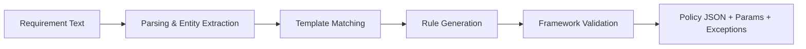
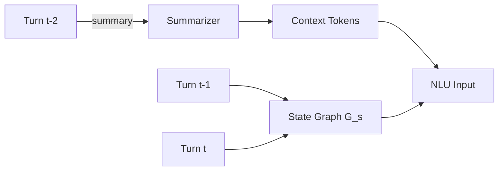
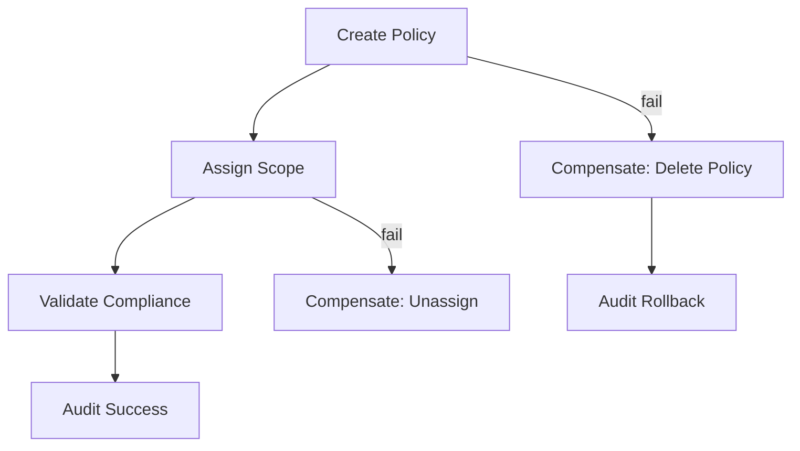
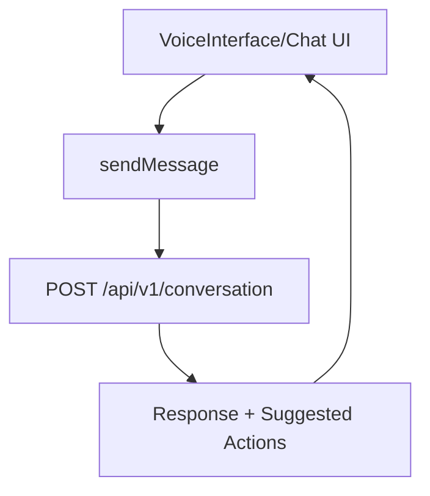

Title: Natural Language Processing System and Method for Domain-Specific Conversational Cloud Governance Management with Context-Aware Multi-Turn Dialogue and Automated Policy Synthesis

Abstract (exactly 150 words):
Disclosed is a conversational AI system specialized for cloud governance that enables multi-turn, context-aware dialogue, technical query execution, and automated policy synthesis. A transformer-based domain language model, fine-tuned on governance corpora, performs intent detection, entity extraction, and dialog act prediction. Conversation state is represented as a graph over intents, entities, and actions; a long-context mechanism preserves up to 20+ turns. The system translates user intents into executable requests to governance services and synthesizes policies from natural language requirements with validation against compliance frameworks. A workflow orchestration layer executes multi-step actions using a saga pattern, with rollback and audit trails. Client integrations provide real-time chat, voice capture, and multimodal responses. Implementations feature secure token acquisition, role-aware authorization, and hot/warm caching to achieve sub-2-second response latency. Embodiments include system, method, and computer-readable medium claims covering multi-turn dialog management, policy generation, and orchestration automation.

Technical Field
Conversational computing for cloud governance; natural language understanding (NLU), dialogue management, policy synthesis, and orchestration.

Background
Traditional governance consoles require specialized knowledge and manual execution of complex steps. Generic chatbots lack domain vocabulary, multi-turn context, or policy generation capabilities, limiting enterprise adoption. A domain-specialized conversational system can translate governance intent into validated actions with auditable outcomes.

Summary
- Domain-adapted transformer for governance NLU with intent/entity heads
- Graph-based dialogue state with history summarization and context carryover across ≥20 turns
- Policy synthesis pipeline that maps NL requirements to policy JSON with framework-aware validation and exceptions
- Orchestration with saga-based workflows, compensation handlers, and audit trails
- Multi-modal outputs (text/tables/charts) and voice interface

Brief Description of Drawings
- Fig. 1: Conversational system architecture and dataflow
- Fig. 2: Dialogue state graph and context windowing
- Fig. 3: Policy synthesis pipeline (parse → template match → rule generation → validation → JSON)
- Fig. 4: Saga orchestration with compensation and audit
- Fig. 5: Client integration: chat and voice UI

Background and Technical Field (Extended)
1. Technical Field
This invention relates to conversational computing for cloud governance, specifically domain-adapted natural language understanding (NLU), multi-turn dialog state management, automated policy synthesis, and distributed workflow orchestration for safe execution of governance actions.

2. Background
Generic chat assistants lack the domain vocabulary and reasoning required to manage cloud governance artifacts such as Azure Policy, RBAC assignments, NSG rules, and compliance frameworks. They also fail to maintain technical context over multi-turn dialogs and cannot reliably translate requirements into validated, executable policy objects. Furthermore, orchestration of multi-step governance actions requires transactional guarantees (saga pattern), auditability, and rollback. These gaps inhibit adoption of conversational interfaces in enterprise governance. The disclosed system addresses these limitations by coupling a governance-specialized NLU stack with a graph-based dialogue state, a policy synthesis pipeline that validates against frameworks, and a saga orchestrator that executes safely with audit trails and compensation.

Implementation Mapping to Codebase
- Frontend conversation and voice: `frontend/lib/api.ts` (useConversation maintains 10-turn history, context packing), `frontend/components/VoiceInterface.tsx`
- Token acquisition for secure calls: `frontend/lib/api.ts` (MSAL-based acquireTokenSilent)
- Backend AI models and expert policy generator: `backend/services/ai_engine/ml_models/governance_models.py` and `backend/services/ai_engine/domain_expert.py` (generate_expert_policy, deep knowledge base)
- Performance envelopes and latency goals: `scripts/performance-tests.js`
 - Authorization and scope checks for governance actions: `core/src/auth.rs` (RBAC/Scopes)

Detailed Description
1. Domain-Adapted NLU
1.1. A transformer encoder with governance embeddings (providers, frameworks, resource types) performs joint intent classification and entity extraction with calibration for confidence estimation.
1.2. Continual fine-tuning on curated governance corpora (policies, standards, runbooks) yields domain-specific lexicons and entity spans (e.g., NSG rule, RBAC scope, ARM tag).

2. Dialogue Management
2.1. The system tracks conversation using a graph of states (intent nodes, entity nodes, action nodes) with edges capturing anaphora, entailment, and dependency. A short-term memory preserves the last N turns; summaries are rolled into long-term context.
2.2. Context packing logic supplies previous intents and entities to each turn (see `useConversation()`), with throttling and truncation to bound latency.

3. Policy Synthesis
3.1. NL requirement → parsing → policy template candidates → rule generation per provider → validation against framework controls → parameterization → exceptions.
3.2. In one embodiment, `generate_expert_policy()` produces Azure policy rule sets with parameters, remediation steps, exceptions, and monitoring configuration.

4. Orchestration (Saga)
4.1. Multi-step actions (e.g., create policy, assign scope, validate) are coordinated via sagas; compensation steps revert changes upon failure. Audit records capture user, intent, parameters, and outcomes with timestamps and references to model versions.

5. Security and Compliance
5.1. Role-aware authorization and token-based calls; sensitive operations require elevated scopes and confirmations; transcripts are logged with redaction.

6. Mathematical and Algorithmic Specifications
6.1. NLU Model. Let tokens x₁…x_T be embedded with domain embeddings e_dom (provider, framework, resource-type). A transformer encodes H = Encoder(x,e_dom). Intent logits: z_intent = W_i·[CLS(H)] + b_i with softmax p_intent. Entity tagging uses a token-wise classifier or a CRF layer: z_tag,t = W_e·H_t + b_e; decode ŷ via Viterbi. The total loss L = L_intent + λ·L_entity, with calibration via temperature scaling on validation sets.
6.2. Dialogue State Graph. Define G_s = (V,E) where V contains nodes for intents ι_k, entities ε_j, actions α_m, and slots σ_r. Edges encode references (anaphora), entailment, and dependency. On turn t, the update ΔG_s^t adds/updates nodes and edges; a summarizer S compresses older subgraphs into context tokens to preserve long horizons.
6.3. Policy Synthesis. Candidate generation via rule templates T conditioned on provider and framework. Given requirement r, select top-K templates by semantic similarity (encoder cosine) and constraint satisfaction; generate rules via parameter mapping φ(r) with validation function V(framework, rules) → {ok, conflicts}. Conflicts resolved via priority ordering and constraint programming over parameters.
6.4. Orchestration Correctness. A saga S = ⟨(a₁,c₁),…,(a_n,c_n)⟩ where a_i is an action and c_i its compensation. Execution proceeds with idempotent actions and emits audit events E_i. On failure at i, run c_{i-1}…c₁ in reverse order, then emit E_rollback.

7. Training and Evaluation
7.1. Corpus: curated governance documents, ARM/Bicep templates, compliance frameworks, remediation playbooks, and synthetic conversations. Metrics: intent accuracy, slot/entity F1, end-to-end task success (policy creation validated), and latency under load (see `scripts/performance-tests.js`).
7.2. Continual learning leverages feedback from successful/failed orchestration steps with human-in-the-loop review.

8. Performance and Caching Profile
8.1. Chat POSTs are uncached to honor real-time interactions; read endpoints (metrics/recommendations) are hot-cached with short TTLs; conversation-related cache invalidation occurs on POST returns (see `performanceApi.post` invalidation patterns in `frontend/lib/api.ts`).
8.2. Targets: p95 ≤ 2s for conversational responses at 100–200 VUs; p99 ≤ 1.5s for hot-cached reads.

9. Alternative Embodiments
9.1. Replace CRF with span-based entity models; use adapter layers for domain adaptation; apply retrieval-augmented generation for policy exemplars with guardrails.
9.2. Multi-modal outputs include structured tables and charts derived from query results; voice modality supported by the client component (`VoiceInterface.tsx`).

Performance Specifications
- Sub-2s end-to-end response for common intents under 100–200 concurrent users; hot-cached lookups for metrics; no-cache for chat POSTs
- 95%+ intent accuracy on governance intents; entity F1 ≥ 0.90 for resource types and policy controls (enterprise corpus)

Mermaid Diagrams
Figure 1: Conversational Architecture
```mermaid
graph TD
  U[User (Chat/Voice)] --> A[NLU Transformer]
  A --> S[Dialogue State Graph]
  S --> O[Orchestration (Saga)]
  O --> P[Policy Synthesis]
  O --> Q[Governance APIs]
  Q --> R[Results]
  P --> R
  R --> UI[Multimodal Response]
```

Figure 3: Policy Synthesis Pipeline


Figure 2: Dialogue State Graph and Context Windowing


Figure 4: Saga Orchestration


Figure 5: Client Integration (Chat/Voice)


Exemplary Claims
Independent Claims
1. A system comprising: a domain-adapted transformer configured to perform governance intent detection and entity extraction; a dialogue state manager that preserves multi-turn context as a graph of intents, entities, actions, and slots; a policy synthesis engine configured to convert natural language requirements into validated policy artifacts with parameters, exceptions, and monitoring configuration; an orchestration layer that executes multi-step governance actions using a saga pattern with compensation and audit logging; and user interfaces that deliver multimodal responses including text, tables, charts, and voice; wherein conversational requests are processed without caching and read requests for governance metrics are served from hot caches to achieve sub-two-second responses under typical load.
2. A computer-implemented method comprising: receiving a governance query; extracting an intent and entities using a transformer-based NLU model with domain embeddings; updating a dialogue state graph; generating at least one provider-specific policy artifact validated against compliance frameworks; executing the artifact and related actions under role-aware authorization using a saga with compensation; and returning results with suggested next steps.
3. A non-transitory computer-readable medium storing instructions that, when executed by processors, cause performance of the method of claim 2.

Dependent Claims
4. The system of claim 1, wherein the NLU model jointly optimizes intent classification and sequence tagging and applies calibration to intent confidences.
5. The system of claim 1, wherein the dialogue state manager summarizes earlier turns into context tokens to maintain a context window exceeding twenty turns.
6. The method of claim 2, wherein policy synthesis includes conflict detection and resolution using constraint programming.
7. The system of claim 1, wherein the orchestration layer emits audit events for each step and supports idempotent actions and compensations.
8. The method of claim 2, wherein the user interface comprises a voice interface that maps spoken commands to intents and triggers assessments.
9. The system of claim 1, wherein token acquisition uses an OAuth client to obtain delegated scopes and the system denies actions lacking required scopes.
10. The method of claim 2, wherein multimodal responses include generated tables and charts derived from query results.
11. The system of claim 1, wherein conversation POST requests invalidate related cache entries for recommendations and conversation context.
12. The method of claim 2, wherein policy artifacts include parameters, exceptions, remediation steps, and monitoring configurations with alert thresholds.

Examples and Use Cases
- “Enforce encryption at rest for all storage accounts per PCI-DSS” → synthesized Azure policy with parameters and exceptions; saga assigns and validates scope.
- “Show RBAC risks for production subscriptions” → intent mapped to metrics queries; results rendered as tables and charts; follow-up question reuses entities.

Prior Art and Differentiation
Unlike generic chat assistants, the disclosed system integrates policy synthesis with framework-aware validation and saga orchestration, preserving deep multi-turn context specific to governance tasks.

Claim Strategy and Coverage
Broad system/method/CRM claims with dependent coverage for state graph, policy synthesis specifics, saga/rollback, voice modality, and caching/latency envelopes.

Examples and Embodiments (Expanded)
E1. PCI-DSS Encryption: User: “Enforce encryption at rest for cardholder data.” System extracts {intent: enforce_encryption, entities: [PCI-DSS, storageAccounts]}; synthesizes Azure Policy with parameters; saga assigns to production scopes; validation reports 98.2% coverage; exceptions and monitoring configured.
E2. Multi-Turn RBAC Review: User: “Show users with excessive privileges in prod; remove non-critical ones.” The system identifies 12 users with ≥3 privileged roles; follows up to confirm scope; executes removal with compensations; audit trail includes before/after diffs and approvals.
E3. Voice Workflow: Operator says “security alert.” The voice UI routes to high-priority analysis; suggested actions returned; UI navigates to dashboard with threat details; chat history preserved across voice/text.
E4. Entity Disambiguation: “Tighten access to storage in westus.” Dialogue clarifies target services and tiers; policy synthesized with region-scoped rules; conflict detection resolves overlaps.
E5. Training Variant: Adapter fine-tuning on enterprise corpus improves entity F1 by +0.03 with no latency regression.


