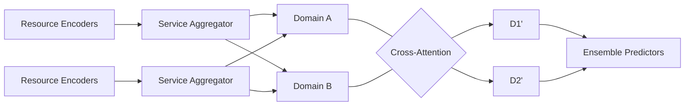
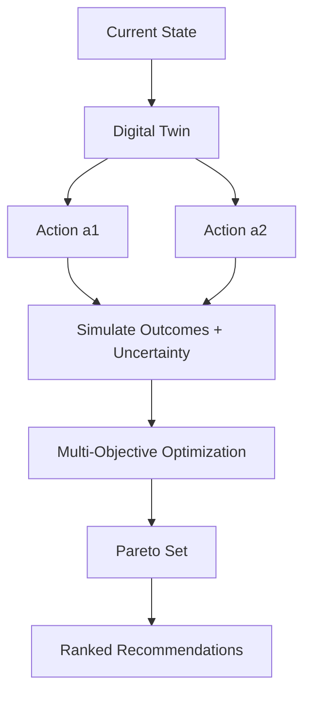
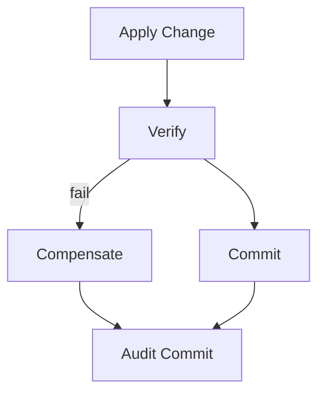
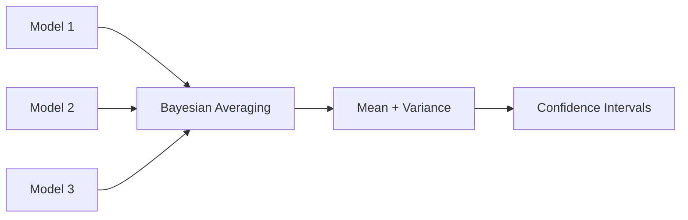

Title: System and Method for Unified Artificial Intelligence-Driven Multi-Service Cloud Governance Platform with Predictive Analytics, Cross-Domain Optimization, and Automated Remediation Orchestration

Abstract (exactly 150 words):
A unified AI-driven platform aggregates governance data from multiple cloud services and orchestrates analytics, optimization, and remediation across domains including compliance, identity, network, resource, and cost. The platform provides a hierarchical AI architecture combining graph encoders, sequence models, and gradient boosting in an ensemble to forecast governance metrics and quantify uncertainty. A digital-twin environment supports what-if simulations and multi-objective optimization (security, compliance, performance, cost), producing Pareto-efficient recommendations with rollback plans. A scalable API layer exposes REST/GraphQL endpoints with hot/warm caching for low-latency dashboards and batch hydration. Real-time ingestion employs asynchronous concurrency controls and Redis-based tiered caches to sustain enterprise throughput. Automated remediation is executed via saga workflows with compensation, audit logging, and role-aware authorization. The system integrates with Azure Policy Insights, RBAC, Cost Management, and Resource Graph, and exposes a conversational/voice interface. Embodiments include system, method, and computer-readable medium claims covering unified orchestration, predictive analytics, and automated remediation.

Technical Field
Cloud governance platforms; AI orchestration; predictive analytics; multi-objective optimization; automated remediation.

Background
Enterprises operate heterogeneous cloud estates with fragmented tooling. Siloed governance leads to suboptimal and risky changes. A unified AI platform coordinating cross-domain analytics and remediations with uncertainty-aware predictions materially improves outcomes and safety.

Summary
- Multi-service aggregation with parallel fetch and typed normalization
- Hierarchical AI ensemble with cross-attention across domains; uncertainty quantification
- Digital-twin simulation and Pareto optimization with constraints
- Saga-based automated remediation with rollback and audit trails
- Real-time dashboards with batch APIs and tiered caching

Codebase Mapping
- Parallel data aggregation, caching, and metrics: `core/src/azure_client_async.rs`, `core/src/cache.rs`
- Frontend batch hydration and hot/warm policies: `frontend/lib/api.ts`
- ML components and ensemble orchestration: `backend/services/ai_engine/ml_models/governance_models.py`
- GraphQL gateway exposure: `graphql/gateway.js`

Background and Technical Field (Extended)
1. Technical Field
This invention relates to unified AI-driven cloud governance platforms that aggregate multi-service data, perform predictive analytics with quantified uncertainty, simulate candidate remediations in a digital twin, compute Pareto-efficient recommendations under constraints, and orchestrate automated remediation with rollback and auditability.

2. Background
Enterprise governance spans policy compliance, identity/rbac, network, resources, performance, and cost. Point tools optimize locally, resulting in conflicting recommendations and risk. Existing AIOps systems rarely incorporate uncertainty estimates and safe execution via digital twins and sagas. Users need a unified platform that reconciles cross-domain tradeoffs with provable constraints, presents ranked recommendations, and executes them safely with monitoring and audit trails. The disclosed platform addresses these needs with a hierarchical ensemble that learns across domains, an uncertainty pipeline, a twin to test changes, multi-objective optimization, and robust orchestration.

Detailed Description
1. Data Aggregation and Normalization
1.1. Parallel collectors retrieve policy, RBAC, cost, network, and resources with token-based auth and connection pooling. Results are normalized and cached by access pattern (hot for dashboards, warm for trends, cold for history).

2. Predictive Analytics and Uncertainty
2.1. A hierarchical ensemble combines graph encoders (for topology), sequence models (for temporal signals), and gradient boosters (for tabular interactions). Confidence intervals derive from Monte Carlo dropout, residual bootstrap, or Bayesian averaging.

2.2. Hierarchical Architecture and Cross-Attention
Resource-level encoders produce embeddings h^R; service-level aggregators produce h^S via attention pooling; domain-level aggregators produce h^D with cross-attention across domains to capture interdependencies. For domains d and d':
\[ H_d' = \mathrm{softmax}\Big(\frac{Q_d K_{d'}^\top}{\sqrt{d_k}}\Big) V_{d'} \]
where Q_d = W_Q h^D_d, K_{d'} = W_K h^D_{d'}, and V_{d'} = W_V h^D_{d'}. The fused domain representation \(\tilde{h}^D_d\) conditions predictions on other domains.

2.3. Ensemble and Uncertainty
Let models m_j produce predictions y_j and variances v_j. Bayesian model averaging (BMA) combines:
\[ \hat{y} = \sum_j w_j y_j, \quad \hat{\sigma}^2 = \sum_j w_j (v_j + (y_j - \hat{y})^2) \]
with weights w_j proportional to model evidences (or calibrated via validation). Dropout-based variances and bootstrap residuals provide v_j.

3. Digital Twin and Optimization
3.1. A digital twin mirrors current governance state; candidate actions are simulated against risk, compliance change, and cost impact. Multi-objective optimization identifies Pareto-efficient sets with constraints (e.g., no violation increase) and recommends actions with expected outcomes and confidence.

3.2. Twin Formalization
Let the governance state be s (policies, roles, network rules, resources, costs). An action a transforms s via a transition model \(s' = T(s,a,\xi)\) with noise \(\xi\). Measurements z derive from outputs via H(s'). The twin tests sequences a₁..a_k and computes predicted metrics f_i(s') (e.g., compliance↑, risk↓, cost↓, performance↑) with uncertainty from Section 2.

3.3. Multi-Objective Optimization
Objectives: maximize \(f_1, f_2, f_4\); minimize \(f_3\). Constraints C include policy constraints, RBAC least privilege, SLO and budget caps. Use NSGA-II or ε-constraint methods to find Pareto set P. A utility U(w) selects top-k actions from P given enterprise weights w, or present P for analyst selection with uncertainty bands.

4. Automated Remediation Orchestration
4.1. Workflows decompose into steps (create/update policy, adjust RBAC, modify NSG, reconfigure resources). Sagas coordinate execution with compensations, emitting audit events and verification checks.

4.2. Orchestration Properties
Each step is idempotent; compensations restore invariants; checkpoints verify absence of regressions; audit entries include actor, scope, diffs, and model/twin version IDs.

5. API Layer and UI
5.1. REST/GraphQL endpoints provide metrics, predictions, correlations, and recommendations. Batch endpoints hydrate dashboards; conversational/voice interfaces translate intents to actions.

5.2. Batch Hydration
Frontend batches four core endpoints for dashboard load (metrics, recommendations, correlations, predictions) to reduce overhead and enable concurrent rendering (`frontend/lib/api.ts`).

Performance Specs
- Target p99 < 1.5s and sustained 200 VUs for core endpoints; batch hydration via four-way requests; cache promotion reduces median latency by >40%.

Mermaid Diagram (Platform Overview)
```mermaid
graph TD
  A[Multi-Cloud Sources] --> B[Parallel Collectors]
  B --> C[Normalization]
  C --> D[Tiered Cache (Hot/Warm/Cold)]
  C --> E[Hierarchical AI Ensemble]
  E --> F[Digital Twin]
  F --> G[Pareto Optimization]
  G --> H[Saga Remediation]
  D --> I[REST/GraphQL]
  I --> J[Dashboard/Chat/Voice]
```

Figure: Hierarchical AI with Cross-Attention


Figure: Digital Twin and Optimization


Figure: Saga Orchestration with Audit


Figure: Uncertainty Pipeline


Exemplary Claims
Independent Claims
1. A system comprising: collectors configured to aggregate governance data from a plurality of cloud services in parallel; a hierarchical artificial intelligence ensemble with cross-attention between domain-level representations configured to forecast governance metrics and provide uncertainty estimates; a digital twin configured to simulate candidate remediations and to evaluate predicted metric changes; an optimization engine configured to compute Pareto-optimal recommendations under governance and service-level constraints; a saga-based orchestrator configured to apply and roll back changes with audit logging and verification; and an application programming interface layer with tiered caching and batch hydration to provide low-latency access to metrics, predictions, correlations, and recommendations.
2. A computer-implemented method comprising: ingesting governance data in parallel; normalizing and caching according to access patterns; generating predictions with uncertainty using an ensemble; simulating candidate changes in a digital twin; computing a Pareto set of recommendations under constraints; orchestrating selected changes using a saga with compensations; and exposing results via REST and GraphQL endpoints.
3. A non-transitory computer-readable medium storing instructions that, when executed by one or more processors, cause performance of the method of claim 2.

Dependent Claims
4. The system of claim 1, wherein uncertainty is computed by Bayesian model averaging of model predictions with variance terms derived from dropout and bootstrap.
5. The method of claim 2, wherein constraints include at least policy compliance non-regression, least privilege for RBAC, service-level objective bounds, and budget caps.
6. The system of claim 1, wherein batch hydration concurrently requests metrics, recommendations, correlations, and predictions to reduce page load time.
7. The system of claim 1, wherein cache tiers include hot, warm, and cold stores with automatic promotion based on access frequency and batch set/get operations.
8. The system of claim 1, wherein the digital twin uses a transition model that injects stochastic perturbations and reports uncertainty intervals for predicted metrics.
9. The method of claim 2, further comprising ranking Pareto solutions by a utility function parameterized by enterprise preference weights.
10. The system of claim 1, wherein audit entries include actor identity, scope, configuration diffs, and identifiers of model and twin versions used to produce the recommendation.

Prior Art and Differentiation
Unlike single-domain tools, the platform unifies cross-domain analytics with uncertainty-aware optimization and automated remediation governed by sagas and auditability.

Examples and Embodiments (Expanded)
E1. Production Cost/Security Tradeoff: Digital twin simulates right-sizing compute and tightening NSG on exposed subnets; Pareto set includes options improving compliance +1.7–2.5% with monthly savings $30–55k; recommended plan selected by weights (security 0.5, cost 0.3, performance 0.2) and executed via saga with verification.
E2. Compliance Non-Regression Guard: Optimization constraints reject candidate actions raising violation risk; twin re-scores with updated telemetry; batch dashboard reflects new recommendations within 30 seconds (hot cache).
E3. Preference Shift: Executives adjust weights to prioritize cost; platform recomputes ranked set; rollback retained for prior policy.
E4. Federated Mode: Per-tenant shards compute local predictions; aggregator composes anonymized metrics to update global uncertainty calibrations.
E5. Failure Handling: On step-3 validation failure, orchestrator triggers compensation of steps 2→1; audit contains model/twin version and diffs.


