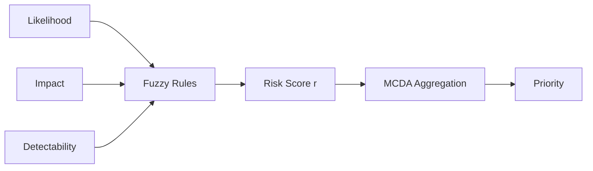

Title: Machine Learning System and Method for Temporal Predictive Cloud Policy Compliance Analysis with Configuration Drift Detection and Automated Risk-Based Remediation Generation

Abstract (exactly 150 words):
A predictive compliance engine forecasts near-term policy violations and detects configuration drift using temporal analysis and representation learning. A variational autoencoder (VAE) learns normal configurations and flags drift via reconstruction error with statistical process control. Time-series decomposition (trend/seasonality/residual) feeds an ensemble of predictors (sequence models and gradient boosting) to forecast violation likelihood with uncertainty bounds via Bayesian model averaging. Motif discovery and regime change detection identify pattern shifts. A risk assessment layer applies fuzzy logic and multi-criteria decision analysis to prioritize interventions by business impact, likelihood, and effort. The engine recommends remediations using case-based reasoning and constraint programming, incorporating rollback plans and audit trails. Real-time ingestion and tiered caching support 100,000+ events per minute. Interfaces expose predictions, explanations, and recommended actions for integration with dashboards and conversational systems. Embodiments include system, method, and computer-readable medium claims.

Technical Field
Temporal ML for cloud governance; drift detection; predictive analytics; risk assessment; automated recommendations.

Background
Periodic compliance scans miss imminent violations and subtle drift. Threshold-based alarms are noisy. A predictive, uncertainty-aware engine enables proactive governance.

Summary
- VAE-based configuration drift detection with SPC thresholds
- STL decomposition, motif discovery, and regime change detection
- Ensemble forecasting with Bayesian model averaging and calibrated uncertainty
- Risk scoring with fuzzy logic and multi-criteria decision analysis (MCDA)
- Remediation recommendations via case-based reasoning and constraints

Codebase Mapping
- Sequence/transformer heads and ensemble controller: `backend/services/ai_engine/ml_models/governance_models.py`
- Domain expert policy/risk knowledge: `backend/services/ai_engine/domain_expert.py`
- Ingestion, caching, and throughput: `core/src/azure_client_async.rs`, `core/src/cache.rs`
- Frontend access patterns and latency expectations: `frontend/lib/api.ts`, `scripts/performance-tests.js`

Detailed Description
1. Drift Detection
1.1. A VAE encodes configuration vectors; drift score = reconstruction error. Control limits are derived from moving windows and SPC (e.g., 3σ rules) with false-positive control via empirical quantiles.
1.2. Alerts are generated upon sustained excursions or pattern anomalies; suspected drift is cross-validated against policy deltas and access changes.

2. Temporal Forecasting
2.1. Series are decomposed into trend/seasonality/residual; residuals inform anomaly likelihood. An ensemble (e.g., LSTM with attention, gradient boosting, Prophet-like trend) produces violation probabilities; Bayesian averaging yields posterior mean and variance.

2.2. Mathematical Specification
Let configuration vector c_t ∈ R^d. VAE encoder q_φ(z|c_t) ~ N(μ_φ, Σ_φ), decoder p_θ(c|z). Loss: L = E_{q_φ}[||c_t − ĉ_t||_2^2] + β·KL(q_φ(z|c_t) || N(0,I)). Drift score s_t = ||c_t − ĉ_t||.
STL decomposition: x_t = T_t + S_t + R_t. Ensemble members m_j produce p(y_{t+h}=1|features) and variance v_j; Bayesian averaging yields mean and variance as in the unified platform disclosure.

3. Risk Assessment and Prioritization
3.1. Fuzzy membership functions model likelihood, impact, detectability; MCDA aggregates with business weights to a priority score. Explanations include feature attribution and historical analogs.

3.2. Fuzzy/MCDA Details
Define membership µ_L(likelihood), µ_I(impact), µ_D(detectability) with triangular/trapezoidal functions. Rule base combines (L,I,D) to risk categories; defuzzify to scalar r. MCDA aggregates r with business weights w via a weighted sum or distance to ideal point.

4. Recommendation Generation
4.1. Retrieve similar cases, adapt solutions, and solve constraints (e.g., policy coverage, dependency, maintenance windows) to produce executable plans with rollbacks and confidence levels.

4.2. Constraints and Rollback
Constraint set includes policy precedence, dependency graphs, maintenance windows, SLO/budget bounds, and approvals. Plans embed compensations and verification checks; audit trails record rationales and similar prior cases.

Performance Specifications
- 24–168 hour forecasts with AUROC ≥ 0.90 on enterprise datasets; ingestion 100k+ events/min; p99 endpoint latency ≤ 1.5s

Mermaid Diagram (Predictive Pipeline)
```mermaid
graph TD
  A[Configs/Events] --> B[VAE Drift Detector]
  A --> C[Time-Series Decomposition]
  C --> D[Ensemble Forecasters]
  D --> E[Bayesian Averaging + Uncertainty]
  B --> F[Risk Assessment (Fuzzy + MCDA)]
  E --> F
  F --> G[Recommendations (CBR + Constraints)]
  G --> H[APIs/UI]
```

Figure: VAE Drift Detection
```mermaid
flowchart TD
  C[Configuration c_t] --> Enc[Encoder q_φ(z|c_t)]
  Enc --> Z[z]
  Z --> Dec[Decoder p_θ(c|z)]
  Dec --> C_hat[Reconstruction ĉ_t]
  C & C_hat --> S[Drift Score s_t = ||c_t - ĉ_t||]
  S --> SPC[SPC Thresholds]
```

Figure: Risk/MCDA


Exemplary Claims
Independent Claims
1. A system comprising: a variational autoencoder trained on configuration states to compute drift scores; a temporal forecasting ensemble configured to predict policy violation probabilities with uncertainty; a risk assessment engine applying fuzzy logic and multi-criteria decision analysis to prioritize remediations; and a recommendation generator employing case-based reasoning and constraint solving to produce executable remediation plans with rollback and audit logging.
2. A computer-implemented method comprising: encoding configurations with a variational autoencoder and computing drift scores; decomposing time series into trend, seasonality, and residual; forecasting violation likelihood via an ensemble and aggregating uncertainty via Bayesian model averaging; calculating risk scores via fuzzy logic and multi-criteria decision analysis; and emitting prioritized remediation recommendations subject to constraints with defined rollback steps.
3. A non-transitory computer-readable medium storing instructions to perform the method of claim 2.

Dependent Claims
4. The system of claim 1, wherein statistical process control thresholds are computed from rolling windows and empirical quantiles to control false positives.
5. The method of claim 2, wherein uncertainty intervals are calibrated via residual bootstrap on validation data.
6. The system of claim 1, wherein recommendation generation enforces maintenance window, dependency, policy precedence, and approval constraints.
7. The system of claim 1, wherein explanations include feature attributions and nearest-case analogs with outcomes and confidence levels.
8. The system of claim 1, wherein ingestion sustains at least 100,000 events per minute and prediction endpoints meet p99 latency of 1.5 seconds or less.

Prior Art and Differentiation
The engine jointly performs drift detection, probabilistic forecasting with uncertainty, risk scoring, and constrained recommendations, enabling proactive governance beyond reactive scanning tools.

Examples and Embodiments (Expanded)
E1. Drift Surge: VAE reconstructs config vectors with error exceeding 3σ for three days; ensemble forecasts 48-hour violation spike p=0.78; recommendation prioritizes encryption enforcement and tag remediation with confidence 0.91; approvals required for prod.
E2. Regime Change: STL residuals indicate motif shift during quarterly peak; MCDA raises priority for cost guardrails; resulting actions reduce predicted violations by 0.14 absolute.
E3. Maintenance Constraints: Recommendations respect 2–4 AM local windows; case-based reasoning selects prior successful runbook; rollback defined for NSG and RBAC adjustments.
E4. Calibration Update: Residual bootstrap adjusts uncertainty intervals after deployment drift; AUROC improves to 0.92 on validation.
E5. Multivariate Inputs: Incorporate RBAC change velocity and NSG churn features, improving early warning lead time by 12 hours on average.


