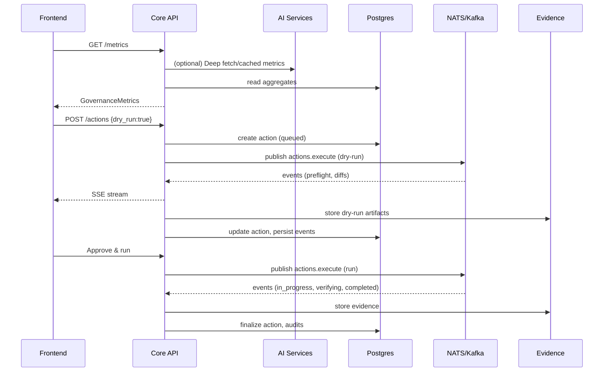

# 2. System Architecture

## 2.1 High-Level View
- Public API: Rust/Axum core (`/api/v1/*`) — authn/authz, safety, orchestration, SSE
- Internal AI services: Python (FastAPI) — deep analyses, generation, predictions
- Event bus: NATS/Kafka — change detection, action lifecycle, telemetry fan‑out
- Storage: Postgres (state/audit), Redis (cache/queues), ClickHouse/Timescale (metrics), S3/Blob (evidence)
- Frontend: Next.js — drill‑downs, action drawer, voice/chat assistant

## 2.2 Component Diagram
```mermaid
flowchart LR
  FE[Frontend (Next.js)] -- HTTPS --> CORE[(Rust Core API)]
  CORE -- GRPC/HTTP --> AI[Python AI Services]
  CORE -- SQL --> PG[(Postgres)]
  CORE -- Cache/Queues --> RE[(Redis)]
  CORE -- Produce/Consume --> BUS[(NATS/Kafka)]
  CORE -- S3 API --> OBJ[(Evidence Store)]
  FE -- SSE --> CORE
```

## 2.3 Data Flow (Detect→Decide→Act→Evidence)


## 2.4 Security & Tenancy
- OIDC (AAD) JWT verification; per‑tenant RLS in DB; per‑request tenant context
- JIT/PIM elevation for destructive ops; short‑lived credentials only
- Audit trail for every privileged step; optional append‑only ledger

## 2.5 Availability & Scalability
- Core stateless; HPA; multi‑AZ Postgres; Redis cluster; NATS streaming
- Backpressure via queues; idempotency keys for POSTs
- SLOs: p99 < 300ms reads; 99.9% uptime; action event delivery < 200ms

## 2.6 Failure Modes & Resilience
- Deep services timeout/circuit breaker → graceful fallbacks
- Queue redrives and DLQs for failed actions
- Evidence generation retries and resume
