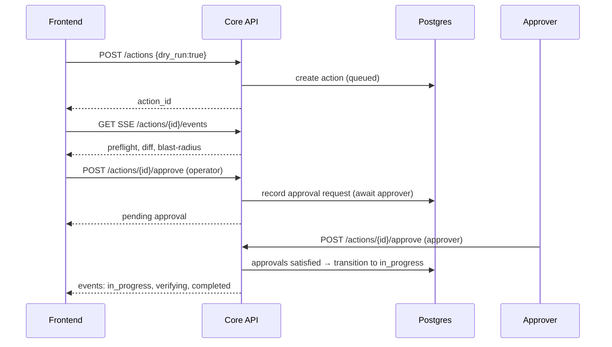

# 17. Approval & Rollback Sequences

## 17.1 Approval Flow (Mermaid)


## 17.2 Rollback Flow (Mermaid)
```mermaid
sequenceDiagram
  participant FE as Frontend
  participant Core as Core API
  participant Worker as Exec Worker
  participant PG as Postgres

  note over Core,Worker: Execution error triggers rollback policy
  Worker-->>Core: event: failed (checkpoint=X)
  Core->>PG: update action status failed; attach diagnostics
  FE-->>Core: POST /actions/{id}/rollback
  Core->>PG: create rollback action, reference original
  Core->>Worker: execute rollback plan
  Worker-->>Core: events: in_progress → completed
  Core->>PG: update rollback action completed; audit both actions
  Core-->>FE: SSE updates and final status
```

## 17.3 Edge Cases
- Partial rollback: only revert successful steps; mark irrecoverable items and propose manual steps
- Expired approvals: require re‑approval if plan changed or TTL exceeded
- Blast‑radius increase post‑preflight: enforce re‑preflight and approval
