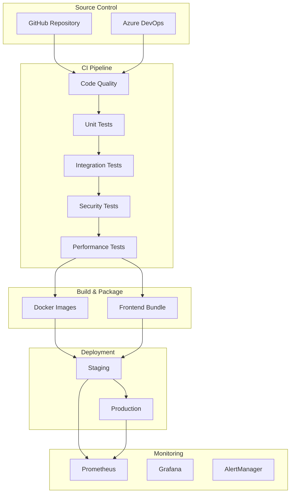

# PolicyCortex CI/CD Implementation Guide

## Overview

This guide provides comprehensive instructions for implementing and managing the CI/CD pipeline for PolicyCortex. The pipeline includes automated testing, security scanning, performance testing, and deployment across multiple environments.

## Architecture



## Pipeline Stages

### 1. Code Quality & Linting

**Purpose**: Ensure code quality and consistency

**Tools**:
- Python: `flake8`, `black`, `isort`, `mypy`
- TypeScript: `eslint`, `prettier`
- Security: `bandit`, `safety`

**Configuration**:
```yaml
# .github/workflows/ci-cd-complete.yml
code-quality:
  steps:
    - name: Python Linting
      run: |
        flake8 . --max-line-length=100
        black . --check
        isort . --check-only
```

### 2. Testing Strategy

#### Unit Tests
- **Coverage Target**: >80%
- **Tools**: pytest (Python), Jest/Vitest (TypeScript)
- **Parallel Execution**: Yes

#### Integration Tests
- **Infrastructure**: Docker Compose
- **Databases**: PostgreSQL, Redis
- **Service Communication**: Full stack testing

#### E2E Tests
- **Tool**: Playwright
- **Browsers**: Chrome, Firefox, Safari, Mobile
- **Scenarios**: Authentication, user journeys

#### Performance Tests
- **Tool**: K6
- **Load Pattern**: 0 → 50 → 100 → 200 users
- **Metrics**: P95 < 500ms, error rate < 5%

### 3. Security Scanning

**SAST (Static Application Security Testing)**:
- Bandit for Python
- ESLint security plugins for JavaScript
- Trivy for container scanning

**DAST (Dynamic Application Security Testing)**:
- OWASP ZAP (optional)
- Custom security test suite

**Dependency Scanning**:
- GitHub Dependabot
- OWASP Dependency Check
- WhiteSource/Snyk

### 4. Build & Packaging

**Docker Images**:
```dockerfile
# Multi-stage build for optimization
FROM python:3.11-slim as builder
COPY requirements.txt .
RUN pip install --user -r requirements.txt

FROM python:3.11-slim
COPY --from=builder /root/.local /root/.local
COPY . /app
WORKDIR /app
CMD ["uvicorn", "main:app", "--host", "0.0.0.0"]
```

**Frontend Build**:
```bash
npm run build
# Output: dist/ folder with optimized assets
```

### 5. Deployment Strategy

#### Blue-Green Deployment
1. Deploy to green environment
2. Run smoke tests
3. Switch traffic to green
4. Keep blue as backup

#### Rollback Strategy
```bash
# Automatic rollback on failure
./scripts/deploy.sh production latest true
```

#### Environment Configuration
- **Development**: Continuous deployment from `develop` branch
- **Staging**: Automatic deployment from `main` branch
- **Production**: Manual approval required

## Implementation Steps

### Step 1: GitHub Actions Setup

1. **Create workflow file**:
```bash
mkdir -p .github/workflows
cp ci-cd-complete.yml .github/workflows/
```

2. **Configure secrets**:
- `AZURE_CREDENTIALS`: Service principal credentials
- `REGISTRY_USERNAME`: Container registry username
- `REGISTRY_PASSWORD`: Container registry password
- `SLACK_WEBHOOK`: Notification webhook

3. **Enable branch protection**:
- Require PR reviews
- Require status checks to pass
- Dismiss stale reviews

### Step 2: Azure DevOps Setup

1. **Import pipeline**:
```bash
az pipelines create --name PolicyCortex-CI-CD \
  --repository https://github.com/yourorg/policycortex \
  --branch main \
  --yml-path azure-pipelines.yml
```

2. **Configure service connections**:
- Azure Resource Manager
- Container Registry
- Key Vault

3. **Set up environments**:
- Development (auto-approve)
- Staging (auto-approve)
- Production (manual approval)

### Step 3: Testing Infrastructure

1. **Local testing**:
```bash
# Start test environment
docker-compose -f docker-compose.test.yml up -d

# Run tests
pytest tests/
npm test

# Stop environment
docker-compose -f docker-compose.test.yml down
```

2. **CI testing**:
- Automatically provisions test databases
- Runs in isolated environment
- Cleans up after completion

### Step 4: Monitoring Setup

1. **Deploy Prometheus**:
```bash
kubectl apply -f monitoring/prometheus-deployment.yml
kubectl apply -f monitoring/prometheus-config.yml
kubectl apply -f monitoring/alerts.yml
```

2. **Configure Grafana dashboards**:
- Import dashboard templates
- Set up data sources
- Configure alert channels

3. **Set up AlertManager**:
```yaml
# alertmanager.yml
route:
  receiver: 'team-notifications'
  group_by: ['alertname', 'severity']
  
receivers:
  - name: 'team-notifications'
    slack_configs:
      - webhook_url: '${SLACK_WEBHOOK}'
        channel: '#alerts'
```

## Best Practices

### 1. Version Control
- Use semantic versioning (v1.2.3)
- Tag releases in git
- Maintain CHANGELOG.md

### 2. Environment Parity
- Keep environments as similar as possible
- Use same container images
- Environment-specific configs via variables

### 3. Testing
- Write tests before fixing bugs
- Maintain test coverage above 80%
- Run performance tests regularly

### 4. Security
- Scan dependencies daily
- Rotate secrets regularly
- Use least privilege access

### 5. Monitoring
- Monitor all critical paths
- Set up proactive alerts
- Track business metrics

## Troubleshooting

### Common Issues

1. **Build failures**:
```bash
# Check logs
gh run view <run-id> --log

# Re-run failed jobs
gh run rerun <run-id> --failed
```

2. **Deployment failures**:
```bash
# Check container logs
az containerapp logs show -n ca-api-gateway-staging -g rg-policycortex-staging

# Rollback
./scripts/deploy.sh staging latest true
```

3. **Test failures**:
```bash
# Run specific test locally
pytest tests/unit/test_auth.py -v

# Debug E2E tests
npx playwright test --debug
```

### Performance Optimization

1. **Parallel execution**:
- Use job matrices for service tests
- Run independent tests concurrently

2. **Caching**:
- Cache dependencies (pip, npm)
- Cache Docker layers
- Cache test results

3. **Resource optimization**:
- Use appropriate runner sizes
- Clean up resources after tests
- Limit concurrent deployments

## Maintenance

### Weekly Tasks
- Review and merge Dependabot PRs
- Check pipeline performance metrics
- Update test data

### Monthly Tasks
- Review and update alerts
- Analyze deployment metrics
- Update documentation

### Quarterly Tasks
- Security audit
- Performance baseline update
- Disaster recovery drill

## Metrics & KPIs

### Pipeline Metrics
- **Build Success Rate**: Target >95%
- **Average Build Time**: Target <15 minutes
- **Deployment Frequency**: Daily to staging, weekly to production
- **Lead Time**: <2 hours from commit to staging

### Quality Metrics
- **Code Coverage**: Target >80%
- **Technical Debt**: Track via SonarQube
- **Security Vulnerabilities**: Zero critical, <5 high

### Operational Metrics
- **MTTR (Mean Time To Recovery)**: Target <30 minutes
- **Deployment Success Rate**: Target >99%
- **Rollback Frequency**: Target <5%

## Conclusion

This CI/CD implementation provides a robust, automated pipeline for PolicyCortex that ensures code quality, security, and reliability. Regular monitoring and maintenance of the pipeline will ensure continued success and improvement over time.

For questions or issues, contact the Platform Team or create an issue in the repository.