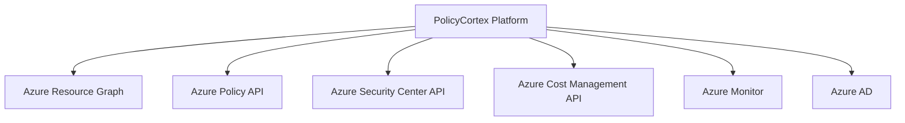

# Azure Governance Tools Comprehensive Analysis

## Executive Summary

This analysis consolidates research on Azure governance tools to inform PolicyCortex platform development and competitive positioning.

## Key Azure Governance Tools

### Core Governance Services

#### Azure Policy
- **Purpose**: Compliance enforcement and governance at scale
- **Key Features**: Policy definitions, assignments, compliance reporting
- **Integration**: Native ARM template support, Azure Arc extension
- **Limitations**: Complex policy syntax, limited real-time remediation

#### Azure Security Center / Microsoft Defender for Cloud  
- **Purpose**: Security posture management and threat protection
- **Key Features**: Security recommendations, compliance dashboards, threat detection
- **Integration**: Multi-cloud support, DevOps integration
- **Limitations**: Security-focused only, expensive for comprehensive coverage

#### Azure Cost Management + Billing
- **Purpose**: Cost optimization and budget management
- **Key Features**: Cost analysis, budgets, recommendations, billing
- **Integration**: PowerBI integration, API access
- **Limitations**: Limited predictive capabilities, reactive cost management

### Advanced Governance Platforms

#### Azure Resource Graph
- **Purpose**: Resource query and discovery at scale
- **Key Features**: KQL-based queries, cross-subscription search
- **Integration**: Azure CLI, PowerShell, REST API
- **Limitations**: Query complexity, limited real-time updates

#### Azure Blueprints
- **Purpose**: Repeatable environment deployment with governance
- **Key Features**: Template orchestration, compliance tracking
- **Integration**: ARM templates, policy assignments, RBAC
- **Status**: Deprecated in favor of Template Specs and Policy

#### Azure Arc
- **Purpose**: Multi-cloud and hybrid governance extension
- **Key Features**: On-premises resource management, policy extension
- **Integration**: Kubernetes governance, server management
- **Limitations**: Complex setup, additional licensing costs

## Competitive Landscape Analysis

### Market Gaps Addressed by PolicyCortex

1. **Cross-Domain Correlation**: Existing tools operate in silos
2. **Predictive Analytics**: Current tools are largely reactive
3. **Conversational Interface**: No natural language governance interaction
4. **Unified Platform**: Fragmented tool landscape requires integration

### Competitive Advantages

#### Patent 1: Cross-Domain Governance Correlation Engine
- **Advantage**: Correlates security, cost, and compliance data
- **Competitor Gap**: Azure tools don't provide unified correlation analytics

#### Patent 2: Conversational Governance Intelligence  
- **Advantage**: Natural language interaction with governance data
- **Competitor Gap**: No Azure-native conversational governance interface

#### Patent 3: Unified AI-Driven Cloud Governance Platform
- **Advantage**: Single platform for all governance domains
- **Competitor Gap**: Microsoft requires multiple separate services

#### Patent 4: Predictive Policy Compliance Engine
- **Advantage**: Proactive compliance drift prediction
- **Competitor Gap**: Azure Policy is reactive, not predictive

## Azure Integration Strategy

### Native Azure Services Integration



### API Integration Points

1. **Resource Graph Integration**
   - Real-time resource discovery
   - Cross-subscription queries
   - Resource relationship mapping

2. **Policy Engine Integration**
   - Policy definition synchronization
   - Compliance state monitoring
   - Automated remediation triggers

3. **Security Center Integration**
   - Security recommendation ingestion
   - Threat intelligence correlation
   - Compliance score integration

4. **Cost Management Integration**
   - Real-time cost data ingestion
   - Budget and forecast synchronization
   - Cost optimization recommendations

## Technical Architecture Recommendations

### Data Ingestion Pipeline
```
Azure APIs → Event Hubs → Stream Analytics → PolicyCortex Correlation Engine
```

### Real-time Processing
- Azure Event Grid for real-time notifications
- Azure Functions for lightweight processing
- PolicyCortex ML engine for correlation analysis

### Storage Strategy
- Azure Cosmos DB for high-velocity governance data
- Azure Data Lake for historical analytics
- PostgreSQL for structured governance relationships

## Market Positioning Strategy

### Primary Value Propositions

1. **Unified Governance Experience**
   - Single pane of glass for all Azure governance
   - Elimination of tool sprawl and context switching

2. **Predictive Governance**
   - Proactive compliance drift detection
   - Cost spike prediction and prevention
   - Security vulnerability forecasting

3. **Conversational Governance**
   - Natural language policy queries
   - Plain English compliance reporting
   - Voice-driven governance operations

4. **Cross-Domain Intelligence**
   - Security-cost-compliance correlation
   - Holistic risk assessment
   - Integrated governance recommendations

### Competitive Positioning

| Capability | Azure Native | PolicyCortex | Advantage |
|------------|--------------|--------------|-----------|
| Policy Management | ✅ | ✅ | Enhanced with AI |
| Cost Management | ✅ | ✅ | Predictive analytics |
| Security Governance | ✅ | ✅ | Cross-domain correlation |
| Unified Dashboard | ❌ | ✅ | Single pane of glass |
| Conversational AI | ❌ | ✅ | Natural language interface |
| Predictive Analytics | ❌ | ✅ | Proactive governance |
| Cross-Domain Correlation | ❌ | ✅ | Holistic insights |

## Implementation Recommendations

### Phase 1: Azure Integration Foundation
- Implement core Azure API integrations
- Establish real-time data ingestion
- Build unified data model

### Phase 2: AI/ML Enhancement Layer
- Deploy correlation analysis engine
- Implement predictive models
- Build conversational interface

### Phase 3: Advanced Governance Features
- Cross-domain analytics
- Automated remediation workflows
- Advanced visualization and reporting

## Conclusion

PolicyCortex's patent portfolio addresses critical gaps in the Azure governance ecosystem, providing unique value through unified, predictive, and conversational governance capabilities that complement rather than compete with Azure's native tools.