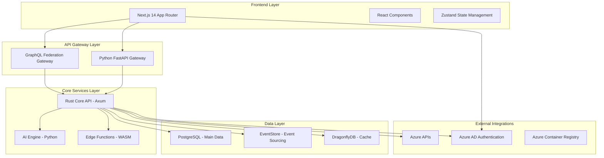
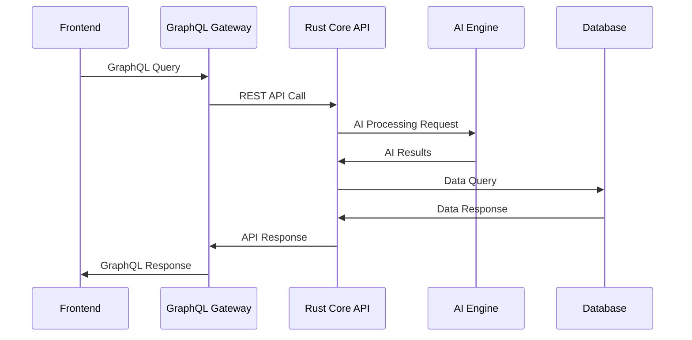

# PolicyCortex System Architecture

## High-Level Architecture



## Core Components

### Frontend Architecture

#### Next.js 14 Application
- **Framework**: Next.js 14 with App Router
- **Components**: Server Components for performance
- **Styling**: Tailwind CSS with custom component library
- **State Management**: Zustand (lightweight Redux alternative)
- **Data Fetching**: React Query for server state management

#### Key Frontend Features
- Server-side rendering for performance
- Real-time updates via GraphQL subscriptions
- Responsive design with mobile support
- Component-driven architecture

### Backend Architecture

#### Rust Core API (Axum Framework)
```
core/
├── src/
│   ├── main.rs              # Application entry point
│   ├── api/                 # API route handlers
│   │   ├── mod.rs
│   │   ├── metrics.rs       # Patent 1: Unified metrics
│   │   ├── predictions.rs   # Patent 4: Predictive engine
│   │   ├── conversation.rs  # Patent 2: Conversational AI
│   │   └── correlations.rs  # Patent 1: Cross-domain analysis
│   ├── auth/                # Authentication & authorization
│   ├── correlation/         # Cross-domain correlation engine
│   ├── ml/                  # Machine learning components
│   ├── remediation/         # Automated remediation system
│   └── tenant/              # Multi-tenant isolation
```

#### AI Engine (Python)
```
backend/services/ai_engine/
├── domain_expert.py        # Core AI engine
├── conversation/           # Conversational AI (Patent 2)
├── prediction/            # Predictive models (Patent 4)
└── correlation/           # Cross-domain analysis (Patent 1)
```

### Data Architecture

#### PostgreSQL - Primary Database
- **Purpose**: Structured governance data, user management, tenant isolation
- **Features**: Row-level security, JSON columns, full-text search
- **Schema**: Multi-tenant with tenant_id isolation

#### EventStore - Event Sourcing
- **Purpose**: Immutable audit trail, event-driven architecture
- **Features**: Event versioning, projections, real-time subscriptions
- **Use Cases**: Governance actions, policy changes, compliance events

#### DragonflyDB - High-Performance Cache
- **Purpose**: Redis-compatible caching with 25x performance improvement
- **Features**: Sub-millisecond latency, distributed caching
- **Use Cases**: API response caching, session storage, real-time data

## Patent Technology Implementation

### Patent 1: Cross-Domain Governance Correlation Engine

```rust
// core/src/correlation/cross_domain_analyzer.rs
pub struct CrossDomainAnalyzer {
    security_correlator: SecurityCorrelator,
    cost_correlator: CostCorrelator,
    compliance_correlator: ComplianceCorrelator,
    ml_engine: MLCorrelationEngine,
}

impl CrossDomainAnalyzer {
    pub async fn analyze_correlations(&self, tenant_id: TenantId) -> CorrelationResults {
        // Correlate security, cost, and compliance data
        // Machine learning pattern detection
        // Risk assessment and recommendations
    }
}
```

### Patent 2: Conversational Governance Intelligence

```python
# backend/services/ai_engine/conversation/governance_assistant.py
class GovernanceAssistant:
    def __init__(self):
        self.nlp_processor = NLPProcessor()
        self.governance_context = GovernanceContext()
        self.response_generator = ResponseGenerator()
    
    async def process_query(self, query: str, tenant_context: TenantContext):
        # Natural language understanding
        # Governance data querying
        # Intelligent response generation
```

### Patent 3: Unified AI-Driven Cloud Governance Platform

```rust
// core/src/api/unified_platform.rs
pub struct UnifiedPlatformAPI {
    metrics_engine: MetricsEngine,
    policy_engine: PolicyEngine,
    remediation_engine: RemediationEngine,
    ai_orchestrator: AIOrchestrator,
}
```

### Patent 4: Predictive Policy Compliance Engine

```rust
// core/src/ml/predictive_compliance.rs
pub struct PredictiveComplianceEngine {
    drift_detector: DriftDetector,
    violation_predictor: ViolationPredictor,
    risk_assessor: RiskAssessor,
    ml_models: MLModelRegistry,
}
```

## Security Architecture

### Zero-Trust Security Model
- **Authentication**: Azure AD MSAL integration
- **Authorization**: RBAC with fine-grained permissions
- **Encryption**: End-to-end encryption with post-quantum cryptography
- **Audit Trail**: Blockchain-based immutable logging

### Post-Quantum Cryptography
```rust
// core/src/security/post_quantum.rs
use kyber1024::Kyber1024;
use dilithium5::Dilithium5;

pub struct PostQuantumSecurity {
    key_exchange: Kyber1024,
    digital_signature: Dilithium5,
}
```

## Performance Architecture

### Sub-Millisecond Response Times
- **Rust Backend**: Zero-cost abstractions, efficient memory management
- **Async Architecture**: Tokio runtime for high concurrency
- **Caching Strategy**: Multi-layer caching with DragonflyDB

### Edge Computing with WebAssembly
```
edge/
├── wasm_functions/
│   ├── policy_evaluation.wasm
│   ├── risk_scoring.wasm
│   └── compliance_checking.wasm
```

### Horizontal Scaling
- **Stateless Services**: All core services are stateless
- **Load Balancing**: Azure Application Gateway integration
- **Auto-Scaling**: Kubernetes HPA based on metrics

## Integration Architecture

### Azure Integration Layer
```rust
// core/src/azure/
├── azure_client.rs          # Synchronous Azure SDK client
├── azure_client_async.rs    # Asynchronous Azure SDK client
├── resource_graph.rs        # Azure Resource Graph integration
├── policy_integration.rs    # Azure Policy synchronization
└── security_center.rs       # Azure Security Center integration
```

### External API Integration
- **Azure Resource Graph**: Real-time resource discovery
- **Azure Policy**: Policy synchronization and compliance monitoring
- **Azure Security Center**: Security recommendations and threat data
- **Azure Cost Management**: Cost analytics and optimization

## Development Architecture

### Microservices Communication


### Event-Driven Architecture
```rust
// Event flow for governance actions
GovernanceEvent → EventStore → Event Processors → Projections → API Responses
```

## Deployment Architecture

### Container Orchestration
```yaml
# kubernetes/
├── core-api-deployment.yaml
├── frontend-deployment.yaml
├── ai-engine-deployment.yaml
├── postgres-statefulset.yaml
├── eventstore-deployment.yaml
└── dragonfly-deployment.yaml
```

### CI/CD Pipeline
```mermaid
graph LR
    A[GitHub Push] → B[GitHub Actions]
    B → C[Build & Test]
    C → D[Container Build]
    D → E[Azure Container Registry]
    E → F[Terraform Deployment]
    F → G[Azure Container Apps]
```

## Monitoring & Observability

### Metrics Collection
- **Rust**: Prometheus metrics with custom collectors
- **Performance**: Sub-millisecond response time tracking
- **Business**: Governance action metrics, compliance trends

### Distributed Tracing
- **OpenTelemetry**: Distributed tracing across all services
- **Azure Application Insights**: Centralized observability
- **Custom Dashboards**: Governance-specific metrics visualization

## Scalability Considerations

### Horizontal Scaling Targets
- **Core API**: 10,000+ concurrent requests
- **AI Engine**: 1,000+ simultaneous ML inferences
- **Database**: Multi-read replicas with write scaling
- **Cache**: Distributed cache clustering

### Performance Benchmarks
- **API Response Time**: <10ms p95
- **ML Inference**: <100ms for correlation analysis
- **Database Queries**: <5ms for governance data
- **Cache Hit Ratio**: >95% for frequently accessed data

This architecture supports PolicyCortex's mission to provide unified, intelligent, and scalable cloud governance at enterprise scale.